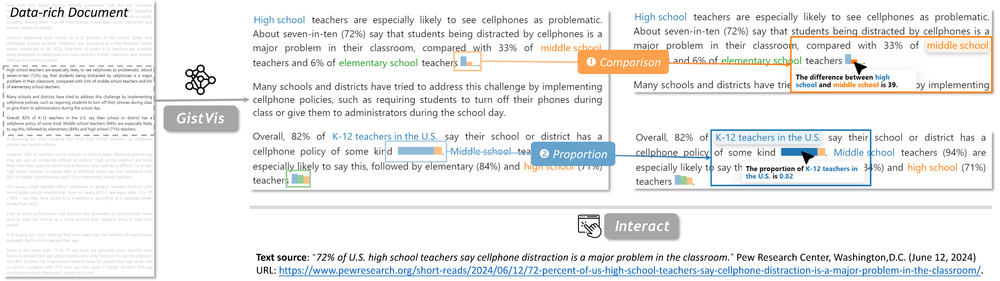

# GistVis

[](https://github.com/prettier/prettier) [](/LICENSE) [](https://www.typescriptlang.org) [](https://arxiv.org/abs/2502.03784)



GistVis is a proof-of-concept research prototype that aims to provide in-situ augmentation of data-rich documents. GistVis blends the power of Large Language Model (LLM) and Visualization Design Knowledge to automatically generate word-scale visualizations (WSV) within documents.

GistVis is also actively evolving as the technical toolchain evolves (prototype implementation in `releases/gistvis-prototype` branch). Building on the research prototype's modular design, our team's immediate next step is separating and improving the WSV module into a React component library to facilitate research and application with WSVs. We welcome constructive criticisms and contributions.

## Using GistVis

We are working on getting GistVis above a research prototype -- as such, we are actively migrating into using a monorepo structure to manage the project:

* Discoverer (stay tuned) - Now in `site/src/modules/llm/discoverer/` folder
* Annotator (stay tuned) - Now in `site/src/modules/llm/annotator/` folder
* Extractor (stay tuned) - Now in `site/src/modules/llm/extractor/` folder
* Visualizer - Published as a npm package [@gistvis/wsv](https://www.npmjs.com/package/@gistvis/wsv) ([](https://www.npmjs.com/package/@gistvis/wsv))

You can also check out some paragraphs and learn more about GistVis at [GistVis demo](https://motion115.github.io/GistVis).

## Citing GistVis

If you find GistVis a fun project, please cite our paper: 

```bib
@article{zou2025gistvis,
    title = {GistVis: Automatic Generation of Word-scale Visualizations from Data-rich Documents},
    author = {Zou, Ruishi and Tang, Yinqi and Chen, Jingzhu and Lu, Siyu and Lu, Yan and Yang, Yingfan and Ye, Chen},
    journal = {arXiv preprint arXiv:2502.03784},
    year = {2025}
}
```

> This work is currently conditionally accepted to ACM CHI 2025.
